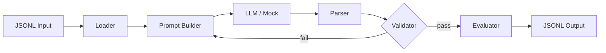

# RPBot — RealPage Context-Aware Message Agent

[](https://www.python.org/downloads/)
[](docs/TESTING.md)

An **autonomous** communication agent for property management that reads JSONL input records and decides **whether**, **how**, **when**, and **what** to communicate—entirely from input context via an LLM, without hardcoded business rules in the production pipeline.

**Repository:** [github.com/sreenuti/RPBot](https://github.com/sreenuti/RPBot)

---

## Problem Summary

Property management teams need context-aware outbound messaging that respects consent, channel preferences, timing constraints, and compliance rules. This agent generalizes to any compatible JSONL dataset by inferring decisions from record fields (profile, preferences, constraints, thresholds)—never from hold-out `expected` outputs at runtime.

See [docs/PROBLEM_STATEMENT.md](docs/PROBLEM_STATEMENT.md) for the original challenge.

---

## Quick Start

```bash
git clone https://github.com/sreenuti/RPBot.git
cd RPBot
python -m venv .venv

# Windows
.venv\Scripts\activate

# macOS/Linux
source .venv/bin/activate

pip install -r requirements.txt

# Run with mock LLM (no API key)
python run.py --input data/sample.jsonl --output outputs/outputs.jsonl --mock --verbose

# Run tests
pytest
```

---

## Architecture Overview



**Design split:**

| Layer | Responsibility |
|-------|----------------|
| **LLM** | Channel, timing, message content, next action, reasoning |
| **Validator** | Consent, schema, Fair Housing, PII, opt-out, CTA alignment |
| **Evaluator** | Personalization score and threshold metrics |

There is **no deterministic decision engine** in the production path. Python validates and scores; the LLM decides.

Full diagrams and component details: **[docs/ARCHITECTURE.md](docs/ARCHITECTURE.md)**

---

## Project Structure

```
├── run.py                  # CLI entrypoint
├── app.py                  # Vercel FastAPI entrypoint (re-exports ui.app)
├── pyproject.toml          # Vercel entrypoint config
├── vercel.json             # Vercel build settings
├── start_ui.py             # Local demo UI launcher
├── requirements.txt
├── pytest.ini
├── data/sample.jsonl       # Example input records
├── docs/
│   ├── ARCHITECTURE.md     # System design & diagrams
│   ├── API.md              # Demo UI REST API
│   ├── TESTING.md          # Test guide
│   ├── CODE_REVIEW.md      # Code review findings
│   ├── INPUT_OUTPUT_SCHEMA.md
│   └── PROBLEM_STATEMENT.md
├── src/
│   ├── loader.py           # JSONL ingestion
│   ├── schemas.py          # Pydantic models
│   ├── prompt_builder.py   # LLM prompt construction
│   ├── llm_client.py       # OpenAI / Gemini / mock
│   ├── output_parser.py    # Response parsing
│   ├── validator.py        # Policy enforcement
│   ├── evaluator.py        # Quality metrics
│   ├── agent_runner.py     # Pipeline orchestration
│   ├── trace.py            # Observability models
│   └── exporter.py         # JSONL export
├── tests/                  # pytest suite (30+ tests)
└── ui/                     # FastAPI demo dashboard
```

---

## Demo UI

Launch an interactive dashboard for team demos:

```bash
python start_ui.py
# Open http://localhost:8080
```

**Features:** JSONL upload, mock/live LLM toggle, pipeline timeline, chain-of-thought reasoning, SMS/email previews, quality metrics.

API reference: **[docs/API.md](docs/API.md)**

### Deploy to Vercel

The FastAPI app is configured for Vercel via `pyproject.toml` (`entrypoint = "ui.app:app"`) and root `app.py`.

1. Import/connect the [RPBot](https://github.com/sreenuti/RPBot) repo in Vercel
2. Leave **Root Directory** empty (project root is the repo root)
3. Add environment variables in Vercel → Settings → Environment Variables (for live LLM, not mock):
   - `LLM_PROVIDER` — `openai` or `gemini`
   - `OPENAI_API_KEY` / `GEMINI_API_KEY`
   - `OPENAI_MODEL` / `GEMINI_MODEL` (optional)
4. Redeploy

**Demo tip:** Keep **Mock mode** enabled in the UI on Vercel for reliable demos (no API key, faster, avoids serverless timeouts). Real LLM runs may hit Vercel’s function duration limits on large batches.

---

## CLI Usage

### Mock mode (no API key)

```bash
python run.py --input data/sample.jsonl --output outputs/outputs.jsonl --mock
```

### Real LLM

1. Copy `.env.example` to `.env`
2. Set provider and API key:

```env
LLM_PROVIDER=openai
OPENAI_API_KEY=sk-...
OPENAI_MODEL=gpt-4o-mini
```

3. Run:

```bash
python run.py --input data/sample.jsonl --output outputs/outputs.jsonl
```

### Hold-out evaluation data

```bash
python run.py --input /path/to/holdout.jsonl --output outputs/holdout_outputs.jsonl
```

---

## Output Schema

Each output line:

```json
{
  "task_id": "prospect_welcome_day0",
  "should_send": true,
  "next_message": {
    "channel": "sms",
    "send_at": "2025-12-09T09:00:00-06:00",
    "subject": null,
    "body": "...",
    "cta": {"type": "schedule_tour", "options": ["Thu", "Fri"]}
  },
  "next_action": {"type": "start_cadence", "details": {"name": "prospect_welcome_short_horizon"}},
  "reasoning": "...",
  "quality": {
    "personalization_score": 0.92,
    "safety_violations": 0,
    "latency_ms": 12
  }
}
```

Full schema reference: **[docs/INPUT_OUTPUT_SCHEMA.md](docs/INPUT_OUTPUT_SCHEMA.md)**

---

## Testing

```bash
pytest tests/ -v
```

| Test module | Coverage |
|-------------|----------|
| `test_loader.py` | JSON parsing, schema errors |
| `test_agent.py` | Output parsing, mock decisions |
| `test_validator.py` | Consent, safety, opt-out, CTA |
| `test_evaluator.py` | Personalization, thresholds |
| `test_prompt_builder.py` | Hold-out safety, retry prompts |
| `test_ui_api.py` | FastAPI endpoints |
| `test_mock_run.py` | End-to-end CLI |

Details: **[docs/TESTING.md](docs/TESTING.md)**

---

## Safety & Compliance

- **Consent** — validator rejects sends on global opt-out or unconsented channels
- **Fair Housing** — blocklist for protected-class and discriminatory phrasing
- **PII** — rejects SSN, phone, email patterns in generated text
- **Opt-out** — SMS/email must include STOP / opt-out / unsubscribe when required
- **CTA alignment** — tour/booking language required when `primary_cta=book_tour`

---

## Design Trade-offs

| Choice | Rationale |
|--------|-----------|
| LLM decides all communication strategy | True autonomy; no hardcoded channel/timing rules |
| Validator + retry loop | Catches consent/safety violations without pre-deciding outcomes |
| Flexible input schema | Hold-out records may add fields without code changes |
| Strict output schema | Downstream systems get predictable JSON |
| Mock mode as test double | CI and offline demos without API keys |

---

## Code Review

A full module-by-module review with findings and recommendations is in **[docs/CODE_REVIEW.md](docs/CODE_REVIEW.md)**.

---

## Productionization Ideas

- Async batch processing with rate limiting
- Queue-based ingestion (SQS/Kafka)
- Observability dashboard (sent/suppressed rates, channel mix)
- LLM-as-judge evaluation for tone and compliance
- Human approval workflow for low-confidence messages
- Immutable audit logs (input hash, prompt, output, validator results)

---

## License

MIT (or specify your license here)
