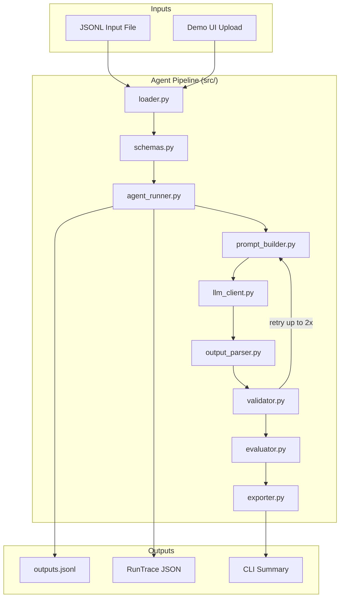
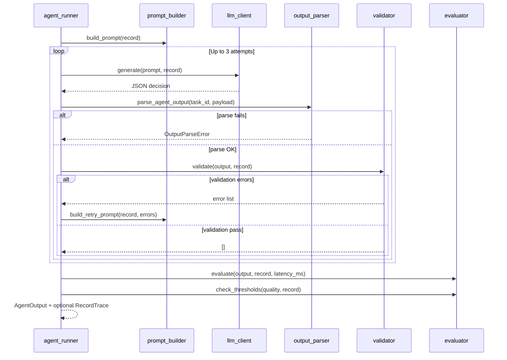
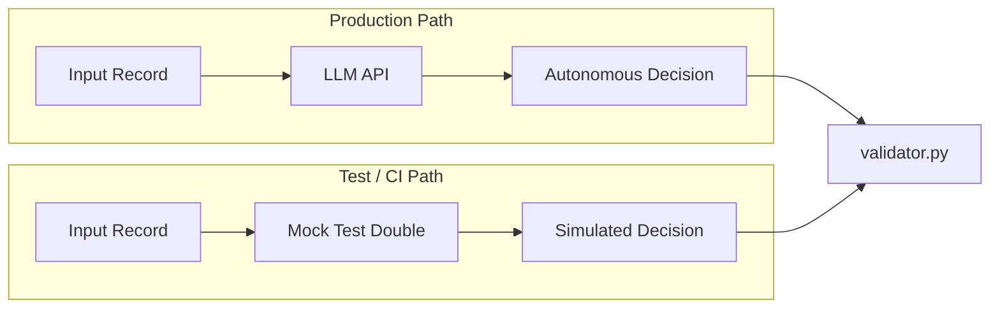
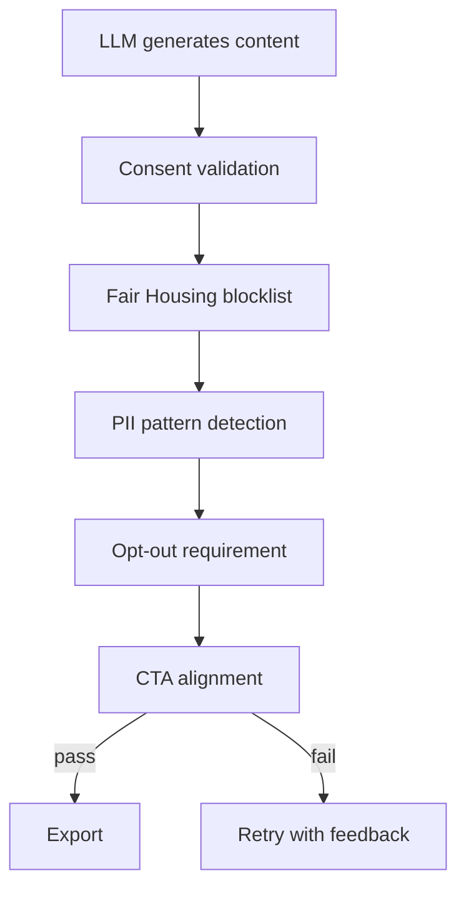

# Architecture

This document describes the system design of **RPBot** (RealPage Context-Aware Message Agent): an autonomous communication agent that decides whether, when, how, and what to message property-management prospects—entirely from input context via an LLM.

## Design Principles

| Principle | Implementation |
|-----------|----------------|
| **LLM decides strategy** | Channel, timing, copy, and next actions come from the model—not hardcoded rules in the production path |
| **Python enforces policy** | Post-generation validation catches consent, schema, and safety violations |
| **Flexible inputs, strict outputs** | Pydantic `extra="allow"` on input models; fixed `AgentOutput` schema for downstream systems |
| **Hold-out safe** | `expected` fields are excluded from prompts at runtime |
| **Observable pipeline** | Full trace capture for demos and debugging via the FastAPI UI |

## High-Level System Context



## Per-Record Processing Flow



## Component Responsibilities

### Data Layer

| Module | Role |
|--------|------|
| `loader.py` | Reads JSONL line-by-line; raises `LoaderError` on malformed JSON or schema failures |
| `schemas.py` | Pydantic models for `InputRecord`, `AgentOutput`, consent, constraints, thresholds |

### Decision Layer (LLM)

| Module | Role |
|--------|------|
| `prompt_builder.py` | Builds structured JSON instructions; excludes `expected` from context |
| `llm_client.py` | OpenAI, Gemini, or mock test double; extracts JSON from responses |
| `output_parser.py` | Maps raw LLM JSON to typed `AgentOutput` |

### Policy Layer

| Module | Role |
|--------|------|
| `validator.py` | Consent checks, channel/subject rules, Fair Housing blocklist, PII patterns, opt-out, CTA alignment |
| `evaluator.py` | Personalization scoring and threshold comparison (metrics only—not decisions) |

### Orchestration

| Module | Role |
|--------|------|
| `agent_runner.py` | Retry loop (`MAX_VALIDATION_RETRIES = 2`), trace capture, batch processing |
| `trace.py` | Pydantic models for pipeline observability (`TraceStep`, `RunTrace`) |
| `exporter.py` | JSONL export and CLI summaries |

### Presentation

| Module | Role |
|--------|------|
| `ui/app.py` | FastAPI backend: upload, sample data, run agent with full trace |
| `ui/static/*` | Dashboard: pipeline timeline, message previews, metrics |
| `run.py` | CLI entrypoint |
| `start_ui.py` | Uvicorn launcher for demos |

## LLM vs Mock Mode



**Important:** Mock mode (`--mock` or UI toggle) uses `_mock_autonomous_decision()` in `llm_client.py`. This is an **offline test double** for CI and demos—it simulates LLM behavior but is **not** part of the production decision philosophy. Real runs always call OpenAI or Gemini.

## Validation Retry Strategy

When validation fails, the agent:

1. Collects error messages from `validator.py`
2. Rebuilds the prompt via `build_retry_prompt()` with feedback
3. Re-invokes the LLM (up to 2 retries after the initial attempt)
4. If still failing after 3 total attempts, exports output with warnings (verbose mode logs unresolved errors)

Parse failures follow the same retry loop.

## Input Record Schema (Conceptual)

```
InputRecord
├── task_id (required)
├── persona, lifecycle_stage
├── consent (email/sms/push/voice opt-in, global_opt_out)
├── channel_preferences[] (priority order)
├── input
│   ├── property_name, move_date_target, last_interaction
│   ├── timezone, language
│   └── profile (first_name + extra fields)
├── assertions
│   ├── required_states[]
│   └── constraints (PII, discrimination, opt-out, primary_cta, quiet_hours, send_at)
├── thresholds (latency, personalization, safety)
└── expected (evaluation hold-out — never sent to LLM)
```

## Output Record Schema

```
AgentOutput
├── task_id
├── should_send
├── next_message { channel, send_at, subject, body, cta }
├── next_action { type, details }
├── reasoning
└── quality { personalization_score, safety_violations, latency_ms }
```

## Scalability Considerations

- **Current:** Sequential record processing in `run_batch()`
- **Horizontal:** Replace the loop with async worker pool or queue consumer (SQS/Kafka)
- **Bottleneck:** LLM latency and cost; batch APIs and prompt caching help at scale
- **Retry cost:** Up to 3 LLM calls per record on repeated validation failure

## Security & Compliance Boundaries



The LLM is instructed to avoid violations in the prompt, but **Python validation is the enforcement layer**—defense in depth.

## Directory Layout

```
realpage-message-agent/
├── run.py                 # CLI
├── start_ui.py            # Demo UI launcher
├── requirements.txt
├── data/sample.jsonl      # Example input records
├── docs/                  # Architecture, API, testing docs
├── src/                   # Core agent pipeline
├── tests/                 # pytest suite
├── ui/                    # FastAPI + static dashboard
└── outputs/               # Generated JSONL (gitignored)
```
