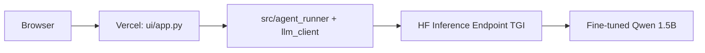

# Production hosting: Colab model → Hugging Face → Vercel UI

This guide walks through the **recommended production path**:

1. Train in **Google Colab**
2. Upload the **merged model** to **Hugging Face Hub**
3. Deploy a **GPU Inference Endpoint** (TGI, OpenAI-compatible)
4. Point **Vercel** (demo UI + agent) at that endpoint

Vercel hosts the **agent app**, not the model weights.

---

## Architecture



| Component | Where it runs | Role |
|-----------|---------------|------|
| Dashboard + `/api/run` | Vercel | UI, validation, scoring |
| Fine-tuned LLM | Hugging Face GPU endpoint | JSON decisions |
| Training | Colab (one-time / periodic) | Produce merged weights |

---

## Step 1 — Train in Colab

1. Export training data locally:

```bash
python scripts/export_finetune_dataset.py \
  --input data/test_cases.jsonl data/sample.jsonl \
  --output data/finetune/train.jsonl \
  --format openai
```

2. Open `notebooks/train_lora_colab.ipynb` in Colab (GPU runtime: **T4** or better).

3. Upload `data/finetune/train.jsonl` when prompted.

4. Run all cells through **§4 Train**. Ensure `merge: True` in the config (default).

5. Run **§5 Smoke test** — you should see JSON-like output.

---

## Step 2 — Verify export before upload

After downloading the zip to your PC, unzip into:

```
models/realpage-message-agent-v1/
```

Verify weights exist (you need `.safetensors` files, not just config):

```bash
python scripts/verify_model_export.py --model-dir models/realpage-message-agent-v1
```

Expected: `OK — model export looks complete` with ~2–4 GB of weights for Qwen2.5-1.5B.

If verification **fails**, the Colab zip was incomplete — re-run training with merge enabled and download again.

---

## Step 3 — Upload to Hugging Face Hub

1. Create a token at [huggingface.co/settings/tokens](https://huggingface.co/settings/tokens) with **Write** access.

2. Upload:

```bash
# Windows PowerShell
$env:HF_TOKEN = "hf_..."

pip install huggingface_hub

python scripts/upload_model_hub.py \
  --model-dir models/realpage-message-agent-v1 \
  --repo-id YOUR_USERNAME/realpage-message-agent-v1 \
  --private
```

Or upload from Colab (§7 in the notebook) after `huggingface-cli login`.

Your model page: `https://huggingface.co/YOUR_USERNAME/realpage-message-agent-v1`

---

## Step 4 — Create a Hugging Face Inference Endpoint

1. Open your model on the Hub → **Deploy** → **Inference Endpoints**.

2. Recommended settings for this project:

| Setting | Value |
|---------|--------|
| Task | Text Generation |
| Engine | **Text Generation Inference (TGI)** |
| Instance | GPU small (T4 / L4) — sufficient for 1.5B |
| Min replicas | 0 or 1 (0 = scale-to-zero, cheaper, cold starts) |
| Max replicas | 1 (demo workload) |

3. Wait until status is **Running**.

4. Copy the endpoint URL. TGI exposes an **OpenAI-compatible** API at:

```
https://YOUR_ENDPOINT.us-east-1.aws.endpoints.huggingface.cloud/v1
```

(Region suffix varies.)

5. Test from your PC:

```env
# .env
LLM_PROVIDER=local
LOCAL_BASE_URL=https://YOUR_ENDPOINT....aws.endpoints.huggingface.cloud/v1
LOCAL_MODEL=sreenuti/realpage-message-agent-v1
LOCAL_API_KEY=hf_...your_token...
LOCAL_JSON_MODE=true
LOCAL_MAX_TOKENS=512
# PROMPT_STYLE=full
```

```bash
python scripts/test_remote_model.py --input data/sample.jsonl
```

You should see parsed JSON with `should_send`, `next_message`, etc.

---

## Step 5 — Connect Vercel

1. Deploy the repo to [Vercel](https://vercel.com) (see README § Deploy to Vercel).

2. In **Vercel → Project → Settings → Environment Variables**, add:

| Variable | Value |
|----------|--------|
| `LLM_PROVIDER` | `local` |
| `LOCAL_BASE_URL` | `https://YOUR_ENDPOINT.../v1` |
| `LOCAL_MODEL` | `sreenuti/realpage-message-agent-v1` (full Hub repo id) |
| `LOCAL_API_KEY` | `hf_...` (same Hub token with inference access) |
| `LOCAL_JSON_MODE` | `true` |
| `LOCAL_MAX_TOKENS` | `512` |

3. **Redeploy** after saving env vars.

4. Open your Vercel URL → turn **off** Mock mode in the UI → run sample data.

### Latency tuning

Average latency in the UI is **per-record end-to-end time**, dominated by the HF GPU call. Typical breakdown:

| Factor | Local PC → HF (eu-west-1) | Vercel → HF (cross-region) |
|--------|----------------------------|----------------------------|
| Model inference | ~1.5–2.5 s | same |
| Network round-trip | ~50–150 ms | **+2–4 s** if Vercel is US and endpoint is EU |

**Do this first:** colocate regions. This repo includes `vercel.json` with `"regions": ["fra1"]` so serverless functions run near **eu-west-1** HF endpoints. Redeploy after pulling that file.

**Already in code (default `PROMPT_STYLE=full`):**

- Prompts omit eval-only `thresholds` and use compact JSON (~25% fewer input tokens).
- The OpenAI client is reused across calls in a batch.

**Optional env tweaks:**

| Variable | Suggestion |
|----------|------------|
| `PROMPT_STYLE=compact` | Shorter prompt; test quality on your suite before prod |
| `LOCAL_MAX_TOKENS=384` | Slightly faster if outputs are not truncated |

**HF endpoint:** keep **min replicas = 1** to avoid cold-start spikes on the first request after idle.

### Vercel tips

- **Mock mode** remains the most reliable option for live demos (no cold start, no GPU cost).
- Real endpoint calls from Vercel may hit **function duration limits** on large JSONL batches — run one record at a time in the UI or use the CLI for batch eval.
- Keep the HF endpoint in the **same region** as your Vercel deployment when possible (e.g. both US).

---

## Step 6 — Evaluate against labeled test cases

From your PC (not Vercel):

```bash
python scripts/eval_lora.py \
  --input data/test_cases.jsonl \
  --output outputs/lora_eval.jsonl
```

Results: `outputs/lora_eval.summary.json`

---

## Local development (optional)

Same `.env` as production, or point at localhost:

```bash
# Terminal 1
python scripts/serve_local_model.py --model-dir models/realpage-message-agent-v1

# Terminal 2
python scripts/eval_lora.py --input data/test_cases.jsonl --output outputs/lora_eval.jsonl
```

Do **not** run local training and local serve simultaneously on a 6 GB GPU.

---

## Troubleshooting

| Problem | Fix |
|---------|-----|
| `verify_model_export` fails — no `.safetensors` | Re-download merged model from Colab; ensure `merge=True` |
| HF endpoint 401 | Check `LOCAL_API_KEY` / `HF_TOKEN` |
| HF endpoint timeout on Vercel | Use Mock in UI; reduce batch size; increase endpoint min replicas to 1 |
| `next_action must be an object` | Model quality — retrain or eval with `--mock` for pipeline check |
| Endpoint fails: `extra_special_tokens` / `'list' object has no attribute 'keys'` | Run `python scripts/fix_tokenizer_config.py --upload`, then restart endpoint on latest revision |
| vLLM: `Engine core initialization failed` on T4 | Run `python scripts/fix_endpoint_config.py --upload`; add env vars `MAX_MODEL_LEN=4096`, `GPU_MEMORY_UTILIZATION=0.75`; or use **TGI** instead of vLLM |
| Port 8000 already in use | Kill old `serve_local_model.py` before restarting |

---

## Cost overview (rough)

| Service | Typical use |
|---------|-------------|
| Colab Pro | Training (~1–3 h per run) |
| HF Hub | Free for private model storage |
| HF Inference Endpoint | ~$0.5–2/hr while GPU is running (T4 class) |
| Vercel | Free tier OK for demo UI |

Scale endpoint **min replicas to 0** when not demoing to avoid idle GPU charges.

---

## Related scripts

| Script | Purpose |
|--------|---------|
| `scripts/verify_model_export.py` | Check merged weights before upload |
| `scripts/upload_model_hub.py` | Push model folder to Hub |
| `scripts/test_remote_model.py` | Single-record endpoint smoke test |
| `scripts/eval_lora.py` | Full labeled eval |
| `scripts/serve_local_model.py` | Local OpenAI-compatible server (dev only) |
| `scripts/train_lora.py` | Local GPU LoRA training |

See also **[FINETUNING.md](FINETUNING.md)** for the full local Windows workflow.
